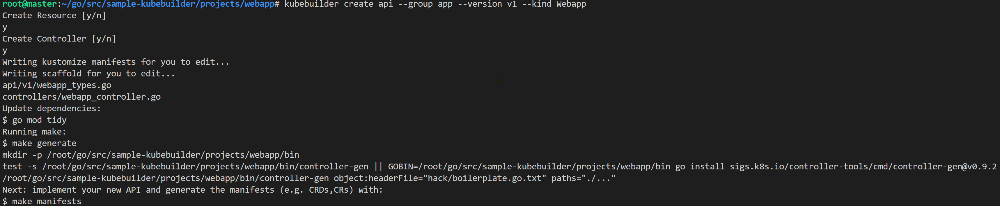
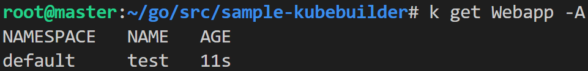
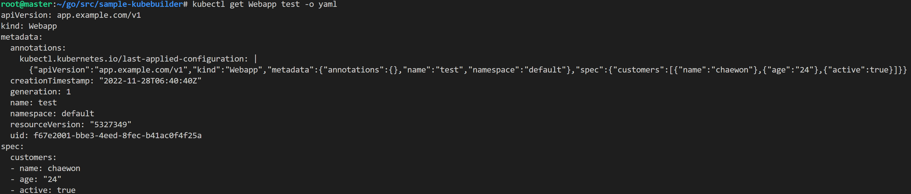

### Kubebuider 사용하기
- Custom Resource Definition과 Controller 생성하기
</br>

1. Install Kubebuilder
</br>

2. create a project
```
cd projects/webapp
kubebuilder init --domain example.com --repo example.com/webapp
```
- config/default 에는 표준 설정으로 컨트롤러를 실행할 kustomize base 가 포함된다.
- config/manager 에는 클러스터내에서 컨트롤러가 파드로 실행되는 필요한 것들이 들어 있다.
- config/rbac 에는 service account 와 연계된 권한 파일들이 들어 있다.
- 엔트리포인트가 되는 main.go 파일이 만들어 진다.
- 참고사항:
    - 3번 실행시, groupversion_info.go 파일 정보
    - ```GroupVersion = schema.GroupVersion{Group: "app.example.com", Version: "v1"}```
        - Group : API 생성시 설정한 GroupName + Domain
        - Version : API 생성시 설정한 Version
        - Kind : API 생성시 설정한 Kind
</br>

3. create an API
```
kubebuilder create api --group app --version v1 --kind Webapp
```

- api/v1/webapp_types.go 파일에 API 정의된다.
- controllers/webapp_controller.go에 Controller 생성된다.
</br>

4. API 설계 및 Controller 만들기
- API : types.go struct 업데이트하기
- Controller : Reconcile 메소드에 로직채우기
</br>

5. Test 해보기
```
./2.build.sh
./3.deploy.sh
./4.create.sh
```



5. Uninstall CRDs
- To delete your CRDs from the cluster
- ```make uninstall```

6. Undeploy controller
- Undeploy the controller to the cluster:
- ```make undeploy```

- 참고 자료
    - ["Kubebuilder Document"](https://book.kubebuilder.io/quick-start.html)
    - ["Custom Controller 만들기 - kubebuilder 활용"](https://devocean.sk.com/blog/techBoardDetail.do?ID=164260)

